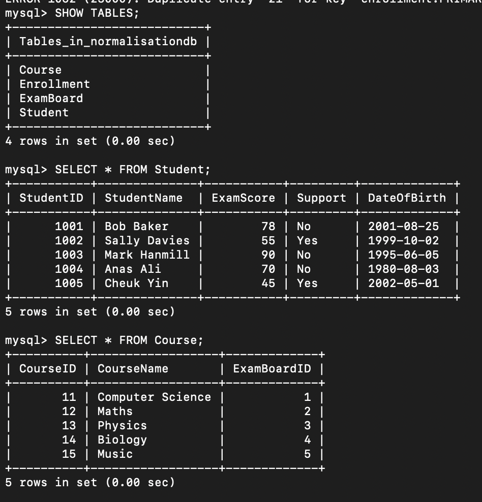
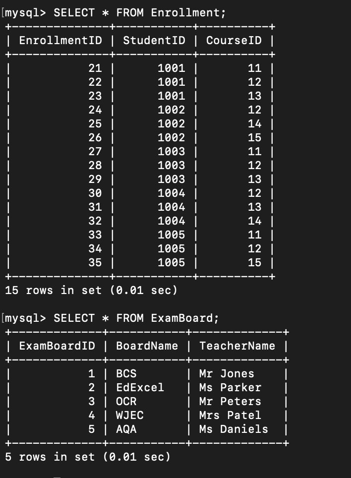

# Database Build Task 

## Aim
Following the completion of the normalisation task, the aim of this task was to:
- Implement the normalised design in a relational database management system (RDBMS), where I used MySQL.
- Use primary and foreign keys to link tables.
- Test referential integrity to ensure relationships between tables are enforced correctly.

## Steps Taken
Using the 3NF structure designed earlier and shown in this [Excel](nf.xlsx) file, the following tables were created:
- 'Student',
- 'Course',
- 'ExamBoard',
- 'Enrollment'.
  
Each table was given a primary key to uniquely identify records and foreign keys were established to link tables. The SQL schema can be seen [here](databuild.sql).

To check that the database was built correctly, the following was inserted into MySQL:
```
SHOW TABLES;
SELECT * FROM Student;
SELECT * FROM Course;
SELECT * FROM Enrollment;
```

The below figures were outputted:




These show that the tables were included into the database as planned.

## Testing Referential Integrity
After ensuring that the tables had been included correctly, the referential integrity of the database was tested.

1. A record was inserted into Enrollment with an incorrect StudentID.
```
-- Should FAIL
INSERT INTO Enrollment (EnrollmentID, StudentID, CourseID)
VALUES (40, 9999, 11);
```
The following was outputted:
```
ERROR 1452 (23000): Cannot add or update a child row: a foreign key constraint fails (`normalisationdb`.`enrollment`, CONSTRAINT `enrollment_ibfk_1` FOREIGN KEY (`StudentID`) REFERENCES `student` (`StudentID`))
```
Meaning the StudentID foreign key was working correctly.

2. A record was inserted into Enrollment with an incorrect CourseID.
```
-- Should FAIL
INSERT INTO Enrollment (EnrollmentID, StudentID, CourseID)
VALUES (41, 1001, 56);
```
The following was outputted:
```
ERROR 1452 (23000): Cannot add or update a child row: a foreign key constraint fails (`normalisationdb`.`enrollment`, CONSTRAINT `enrollment_ibfk_2` FOREIGN KEY (`CourseID`) REFERENCES `course` (`CourseID`))
```
Meaning the CourseID foreign key was working correctly.

3. A course was deleted which was linked to existing Enrollment records.
```
-- Should FAIL
DELETE FROM Course WHERE CourseID = 11;
```
The following was outputted:
```
ERROR 1451 (23000): Cannot delete or update a parent row: a foreign key constraint fails (`normalisationdb`.`enrollment`, CONSTRAINT `enrollment_ibfk_2` FOREIGN KEY (`CourseID`) REFERENCES `course` (`CourseID`))
```
Meaning referential integrity was preserved since one can't delete a course which is in use by enrollments.

4. Add a new, valid record.
```
-- Add a new Exam Board
INSERT INTO ExamBoard (ExamBoardID, BoardName, TeacherName)
VALUES (6, 'Pearson', 'Dr Green');
-- Add a new Course linked to that board
INSERT INTO Course (CourseID, CourseName, ExamBoardID)
VALUES (16, 'Chemistry', 6);
-- Add a new Student
INSERT INTO Student (StudentID, StudentName, ExamScore, Support, DateOfBirth)
VALUES (1006, 'Liam Patel', 82, 'No', '2000-04-12');
-- Enroll the new student in the new course
INSERT INTO Enrollment (EnrollmentID, StudentID, CourseID)
VALUES (36, 1006, 16);
```
The following was outputted:


This shows that the new student was added correctly and that relational integrity is upheld.

All tests passed.

## Skills gained
- Designed and built a fully linked relational database.
- Practical experience with SQL and schema validation.
- Gained better understanding of how relational integrity maintains data accuracy and consistency.

The skills gained align with the Learning Outcomes of this task. The only area not covered was collaboration with my peers, which is something I plan to practice in future.

## Reflection
Building the database from the 3NF design showed me how the normalisation principle works in practice. Testing the foreign keys demonstrated the importance of emforcing relationships at the database level.

[← Back to Home](https://mmiz02.github.io/eportfolio/)


