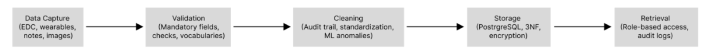
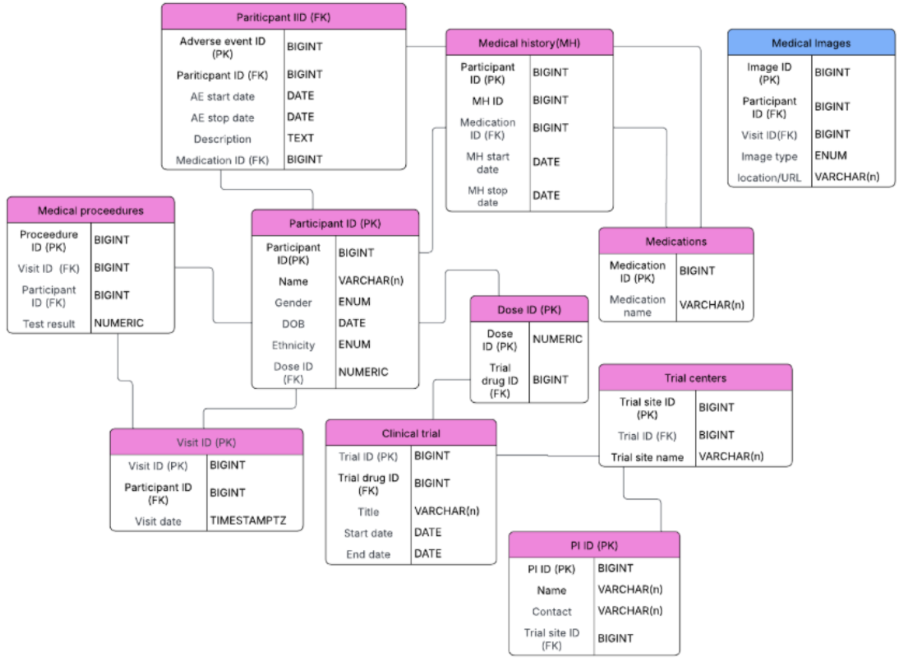

# Team Project: Clinical Trial Database Report

## Aim
To collaboratively design and document a secure, scalable, and compliant database solution for a global clinical research organisation conducting clinical trials while meeting GDPR requirements (European Union, 2016).

## Project Overview
Our team, acting as Software Consultants and Developers, was contracted to design a database capable of storing, managing, and analysing sensitive, clinical and personal data. The solution needed to ensure data integrity, auditability, and compliance with international regulations, while enabling role-based access for multiple stakeholders (staff, regulators, etc.).

PostgreSQL was adopted as our database management system, supported by AWS RDS for hosting and AWS S3 for unstructured data, including medical images (AWS, 2025; EMA, 2023). The system was designed around a structured data management pipeline (Figure 1) and an entity-relationship model (Figure 2), ensuring relational integrity, normalisation (3NF), and security.

> Figures and diagrams (ERD, data flow pipeline) can be embedded here as screenshots or `.png` files stored in your repository:
> ```markdown
> 
> 
> ```

## Data Management Pipeline
Our proposed pipeline included:
1. **Data Capture:** Data is captured via electronic data capture systems in a standardised structured manner.
2. **Validation:** Mandatory fields are enforced during data entry, and validation methods such as range checks are used to minimise entry errors.
3. **Cleaning:** Data will be standardised and machine learning methods will be used o flag anomalies. All changes to data will be traceable.
4. **Storage:** PostgreSQL will be used ensuring integrity, with encryption at rest and in transit.
5. **Retrieval:** Data will have role-based access with audit trails logging access, edits, and queries.

## Database Management Systsem (DBMS) Selection
PostgreSQL was chosen due to its:
- Reliable and flexible storage of mixed data, supporting JSON for its device data.
- Secure linkage to external storage.
- Support of machine learning.
- Strong auditing,  encryption, and regulatory compliance features.

- Alternatives such as Microsoft SQL Server and NoSQL databases were evaluated but found less suitable due to vendor dependency and limited relational integrity and auditability.

## Hosting Solution
Amazon Web Services (AWS), Azure, and Google Cloud Platform were compared, after which our team selected AWS for PostgreSQL due to its:
- Automated backups.
- Multi-region deployment.
- Compliance with GDPR.
- Secure storage for unstructured data by integrating with AWS S3.

## My Contribution to this project
My contribution included researching hosting solutions, choosing datatypes for the attributes in the ERD, and structuring the management process. I also consolidated and proofread the document before submission.

## Online Meeting Minutes and Collaboration
Our team started collaborating over email. After coming up with a rough idea of the type of company, the ERD, and the database pipeline, we held meetings on Zoom to distinguish between our roles and document our progress, ensuring effective collaboration.

23rd August 2025 - The current draft was discussed in line with the task instructions. I proposed building on the entity description and database build, to which Sonya was assigned. Dean added further suggestions regarding the database build. I was assigned with researching hosting solutions.

We all agreed to review the document as a whole and edit as needed. Sonya and I agreed to review the lecturecast in Unit 6 to ensure our project aligned with expectations. It was agreed that we would have a finalised draft by 1st September.

3rd September 2025 - Could not attend this meeting as I had prior arrangements. The final version of the report was agreed upon and sent to me for final proofreading.

We collaborated using shared GoogleDocs, which improved transparency, traceability, and accountability.

## Feedback and Reflection
Feedback from lecturer.

Through this project I learned more about database pipelines and management systems. I also got a deeper understanding of hosting solutions and DBMS selection depending on company needs and alignment with regulatory and GDPR requirememts.

## Skills Developed
- Database design and relational modelling (ERD, 3NF)
- Data pipeline design and validation techniques
- Technical writing and documentation
- Team communication and collaboration using remote tools

## References
Amazon Web Services (2025). *Amazon RDS for PostgreSQL – Features.* Available at: [https://aws.amazon.com/rds/postgresql/](https://aws.amazon.com/rds/postgresql/)  
European Medicines Agency (2023). *Guideline on computerised systems and electronic data in clinical trials (EMA/INS/GCP/112288/2023).* EMA, Amsterdam.  
-European Union (2016). *Regulation (EU) 2016/679 of the European Parliament and of the Council of 27 April 2016 (GDPR).* Available at: [https://eur-lex.europa.eu/eli/reg/2016/679/oj](https://eur-lex.europa.eu/eli/reg/2016/679/oj)  
Google Cloud (2025). *Cloud SQL for PostgreSQL.* Available at: [https://cloud.google.com/sql/postgresql](https://cloud.google.com/sql/postgresql)  

[← Back to Home](https://mmiz02.github.io/eportfolio/)
